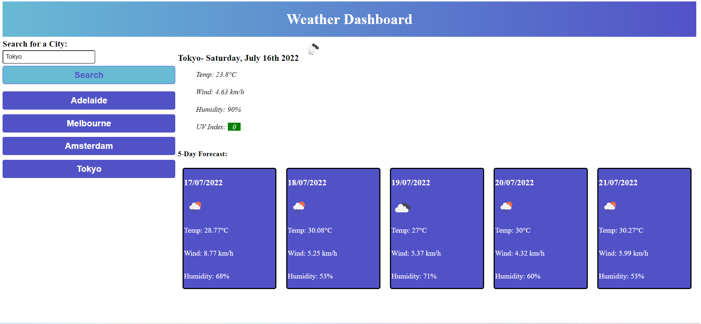

# Weather-Dashboard
## Introduction
This project is a Weather Dashboard, which allows the user to input a city name they would like to view weather information for. The information will show up for the current day in that location, as well as for the next 5 days. There is also a history section where previous searches are so the user can view those searches again quickly.

## Functionality
### Search Section
There is a search bar where the user can input the city they wish to view the weather information for. They can then click the submit button to input the search name. The search city title will be saved to the local storage so it can be used for later use in the history section. This search also triggers the API call by inputting the search city name into the API request url.

### API
The API request initially from the search submit will send out the city name within the request and then return a GeoCoder response that contains longitude and latitude, which matches up to the city searched. 

Once this latitude and longitude has been received, it will then be sent to another API request that will then return through OneCall the relevant information, they are- temperature, wind speed, humidity, UV index, UNIX code and icon code. As well as information fo the next 5 days.

This information from the API is then sent to other functions through Javascript and then adds them to the webpage by using the DOM.

### History
Under the search bar is a history section, where search results are saved within buttons. The buttons use API recall functions and once clicked will show up the relevant information for the weather in that current city clicked. This saves the user time from typing in city names they have previously searched before.

### Current Day
In the main section at the top is the current day section for the weather. It provides information about the location, date, weather representation icon, temperature, wind speed, humidity and UV index. This changes once a new search takes place.

### Future Days
In the main section at the bottom are cards that represent the next 5 days of weather information for the city that was searched. The information for those days is date, weather representation icon, temperature, wind speed and humidity. The UNIX code is used to find the future dates from the API request.

## Screenshot

## Deployed URL